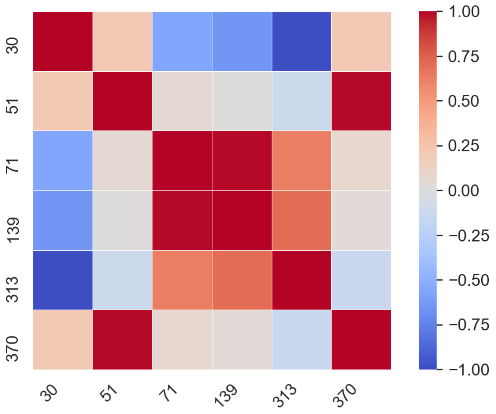
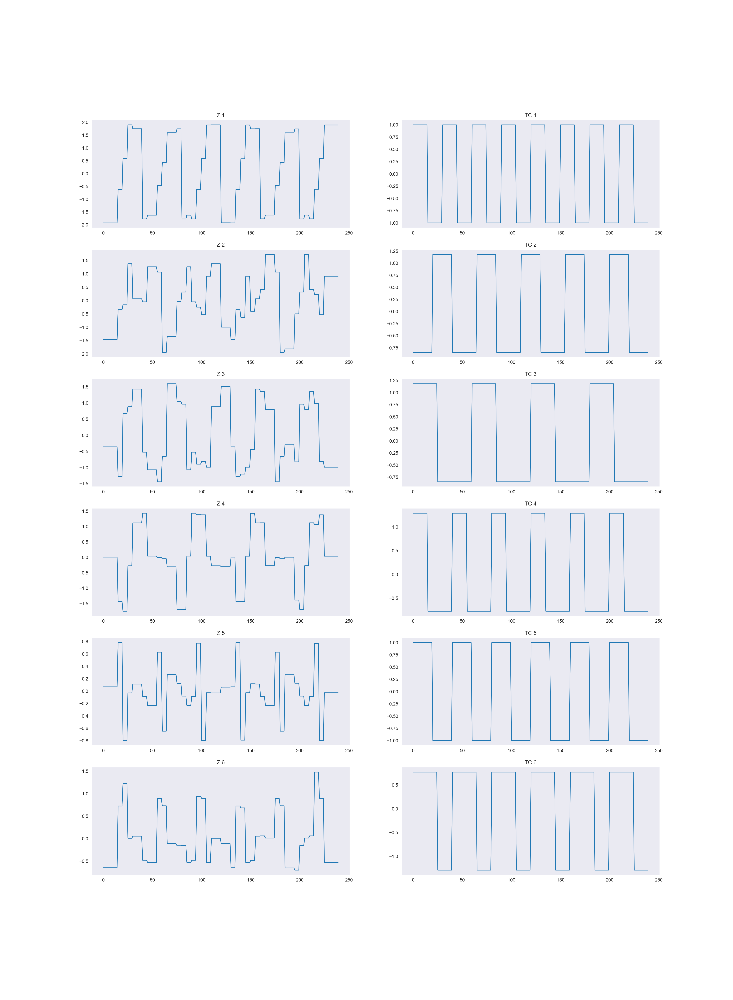

Geospatial Analysis
==================

# Question 1

## Part 1

Figure 1 shows the plots for each standardised TC. If we normalised the
data rather than standardised it, each value would be either 0 or 1.
This would mean we would lose information about spread of the data. For
example, in  the data is centred around 0, meaning the TC
vector's value is equally -1 and 1. For  however, the
data is centered around 0.25, which shows that the value of the
 vector is more likely to be 1 rather than 0. We
therefore normalise rather than standardise to keep this information
about different distributions within time courses.

*Figure 1: The six temporal sources making up matrix TC*

## Part 2

Looking at the plots in Figure 1, it. can be deduced that time courses
4, 5 and 6 are all quite similar. When one of these time courses is at
it's maximum value, it is likely that the other time courses are at
their peak as well. This is confirmed by the correlation matrix (CM) in
Figure 2. This Figure shows that the highest correlation exists between
 and , and between  and
.

*Figure 2: A CM representing the correlation between the 6 TC variables*

*Figure 3: The six spatial map sources*

## Part 3

From the plots of each spatial map source in Figure 3, it can be seen
that none of the areas where the temporal signal is activated in each
plot overlaps with another plot. The independence is confirmed by Figure
4, which shows there is no correlation between any of the spacial map
sources. There is no need to standardise the spatial maps, as opposed to
the time courses. This is because it is important that the pixel values
are either 0 or 1 in the theoretical model. This is because when we
multiply **TC** by **SM** the values representing pixels that are not
activated (i.e. SM value is 0) should also be 0. It must be noted
however that this is only in the theoretical model, as it does not
account for noise. Also, the data does not need to be standardised as it
is simply communicating whether a given space is activated or not. If
one of the slices had pixel values of 5, while others remained at one
for instance, each slice would still equally communicate which spaces
are activated, and the 5 would not give us any extra information.

*Figure 4: CM of the six spatial map sources*

## Part 4

From the CMs below (Figures 5 and 6), we can see that the white Gaussian
noise for temporal and spatial sources is only slightly correlated
between sources. Figures 7 and 8 show the distributions of the noise.
The noise looks to be normally distributed for the most part, and this
is confirmed by the sample mean and variances for the distributions (see
table 1). This is also supported by the fact that close to 95% of the
data in both cases is in the range
[-1.96,1.96]. The variables in the
product  are very correlated. Figure 10 shows the
number of  variables which have a certain level of correlation with
at least one other variable in the data set. All 441 variables have a
correlation of 0.7 with at least one other variable, and 6 variables
have a correlation of at least 0.989 with at least one other variable.
These variables are shown in figure 9, where it can be seen that this
strong correlation is a mixture of positive and negative correlation.\

| Distribution | Sample Mean  | Sample Variance  | \% of Data withing range [-1.96,1.96] |
| ------- | --- | --- | --- |
|  | -0.011 | 0.241 | 95.6% |
|  | -0.002 | 0.0143 | 94.7% |

*Table 1: Distribution statistics for Γt and Γs*

|  |   |
|:---:|:---:|
| Figure 5: CM for Γt | Figure 6: CM for Γs |

|  | |
|:---:|:---:|
|Figure 7: Distribution of Γt|Figure 8: Distribution of Γs|

|  |  |
|:---:|:---:|
|Figure 9: 6 variables with the strongest correlation to another variable|Figure 10: Number of variables with certain level of correlation with at least 1 other variable|

|  | |
|:---:|:---:|
|Figure 11: 100 of the variables from **X**|Figure 12: Variances of 441 variables in **X**|

## Part 5

When expanding the X matrix, we get the products **TC** x **SM**,
**TC** x ****, **** x **SM**, and
**** $\cdot$ ****. We know that the product **TC**
x **SM** is represented by **DA** in the linear model equation,
and the product **** x **** is represented by
**E**. This leaves the remaining products **TC** x ****
and **** x **SM**. Since these are multiples of randomly
generated variables with , the products also have an average
value of 0. This means they are also part of the model error, and
therefore part of **E** in our final model. Figure 12 shows us the
distribution of the variances of each column of **X**. Each column of
**X** represents a pixel on the SMs, and therefore it is not surprising
that there is an increase in variance around columns  30 to  100 and
columns  300 to  400. This is because there is greater variance in those
pixels as they take on the values 1 and 0. In each spatial map, we see
the middle is always 0, which is why the pixels  100 to  300 have much
lower variance. This variance is only due to the noise.

# Question 2

## Part 1

From Figure 14, we see a strong positive linear relationship between the
30th column of **X** and the 3rd column of . The
30th column of X represents the 9th pixel in the 2nd column of the
spatial maps. The 3rd column of  represents our
retrieval of the 3rd column of **TC**, the time course relating to the
3rd spatial map. The reason for the strong correlation is that the 9th
pixel in the 2nd column of the 3rd spatial map is activated. This
relationship is not present with any other column of 
as none of the spatial maps to which these time courses relate have
their 30th pixel activated.

*Figure 13: The relationships between the 30th column of X and the 3rd and 4th column of *

*Figure 14: The 6 retrieved sources using least squares regression*

## Part 2

Using a guess and check method to ensure that
 \sum{c_{TLSR}}">,  was used for the Ridge
Regression. The following values were obtained:

We can see below in Figure 15 that the overall relationship between
predictors in  and  is similar. The
value of these predictors however is very different, as we see that the
scale for the  values is much smaller, meaning that the
values of the predictors has been shrunk a lot more than in the Ridge
Regression as opposed to the Least Squares Regression. This is because
we have increased  to 1000, which means the effect of the Least
Squares Regression in our Ridge Regression model is less significant,
and co-efficients of the model are more heavily penalised and shrunk
towards 0.

*Figure 15: The first vector from  with λ = 1000, and the corresponding vector from *
## Part 3

The minimum MSE was found at the value . This is a suitable
value to choose for  as it is not so large that it has shrunk all
predictors to 0, but it is high enough to ensure that we have adequately
fit our model. We could, however, consider using an elbow method
approach and choose the value of $\rho$ at which the MSE stops
decreasing significantly. This would be if we wanted to ensure we keep
most of our predictor variables whilst still obtaining a low MSE. The
value of $\rho$ started increasing again right after our optimal value
(), and at , the MSE stayed at 1.0, suggesting
that all of our variables have been shrunk very close to 0, or even
removed.

*Figure 16: The Mean Squared Error for each value of ρ*

## Part 4

Using , we are able to calculate  and
 with LASSO regression. The correlation results are
below in Table 2. We can see that these results are as expected, as the
relationships  \sum{c_{TRR}}"> and
 \sum{c_{SRR}}"> hold. We can also see in Figure 17 that
the Ridge Regression has many more false positives (yellow spots) in the
retrieved spatial maps, compared to the LASSO regression. This is most
likely due to Ridge Regression's penalisation term being a squared
value, as opposed to an absolute value, like it is in LASSO. What this
means is LASSO not only punishes high co-efficient values, but also
removes them completely if they are not relevant. Ridge Regression on
the other hand just shrinks this co-efficients to a small value, which
may explain this high number of false positives. It must also be noted
that the regularisation parameter for Ridge, , was not not
obtained by minimising the mean squared error, but found by simply using
guess and check. This also may have contributed to the lack of accuracy
in the retrievals using Ridge Regression.

| Correlation Vector | Approximate Sum  |
| ------- | --- |
|  | 5.148 |
|  | 3.577 |
|  | 5.395 |
|  | 5.032 |

*Table 2: Correlation values between original data and retrieved data for Ridge and LASSO Regression*

*Figure 17: The 6 retrieved sources using Ridge Regression and LASSO Regression*

## Part 5

From Figure 18 we can see that the PC which has the smallest eigenvalue
is the 5th principal component (. The PCs
have little resemblance to the time courses (Figure 19). This is because
the PCs are built from the eigenvectors of the covariance matrix, and
hence they are orthogonal, unlike our original time courses which have
high correlation (Figure 2). The PCs are also linear combinations of all
of the TCs, and therefore we do not expect them to each resemble a
specific TC. Using these PCs is not a good idea, as they are not
reflective of our original data. This is confirmed in the poor results
from our LASSO Regression using the PCs (Figure 20). The spatial maps
are a strong visual indication of why the PCs should not be used as each
retrieval reflects how each PC was a mixture of all the data. For
instance, the retrieval of SM from PCA 2 looks to be mainly made up of
vectors 1 and 3 from **SM**. The retrievals of the TCs also do not
resemble the original data from **TC**. This is unsurprising as the
matrix from which these retrievals were built, **Z**, does not bear
resemblance to the original time courses.

*Figure 18: The eigenvalues of each principal component*

*Figure 19: The regressors in **Z** and source the TCs*

*Figure 20: The 6 retrieved sources using LASSO with PCA*
